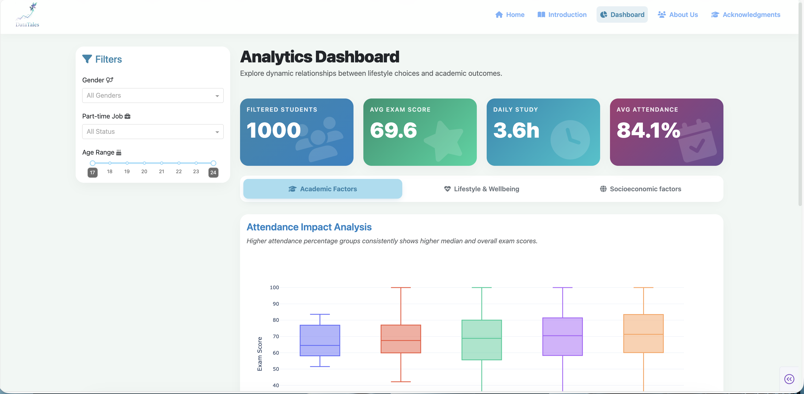

# DataTales: Student Performance Dashboard

[](https://www.python.org/)
[](https://dash.plotly.com/)
[](https://plotly.com/python/)
[](https://pandas.pydata.org/)

An interactive web dashboard built with Plotly and Dash that explores the correlation between student lifestyle habits (e.g., sleep, social media use, diet) and their academic performance.

This project was created for the ICT305: Data Visualisation and Simulation course at Murdoch University Dubai.


*(**Note:** To make this image appear, take a screenshot of your running dashboard, name the file `DASHBOARD_SCREENSHOT.png`, and add it to your GitHub repository.)*

## 📖 Table of Contents

* [Project Overview](#-project-overview)
* [Features](#-features)
* [Technical Stack](#-technical-stack)
* [How to Run This Project](#-how-to-run-this-project)
* [Live Demo](#-live-demo)
* [Team & Acknowledgments](#-team--acknowledgments)

## 🎯 Project Overview

In today's academic environment, a student's success is influenced by more than just study hours. This dashboard aims to answer questions like:

* How strongly does class attendance predict exam scores?
* Is there an "optimal" number of study hours before returns diminish?
* What is the impact of social media usage, sleep quality, and part-time work on academic results?

The **DataTales** dashboard provides an interactive tool for educators, administrators, and students to visually explore these complex relationships and uncover actionable insights.

## ✨ Features

* **Multi-Page App:** A clean and modern interface with separate pages for Home, Introduction, the Dashboard, and About Us.
* **Interactive Dashboard:** The main dashboard features dynamic filters for:
    * Gender
    * Part-time Job Status
    * Age Range
* **Dynamic Visualizations:** All charts and statistics update instantly based on filter selections.
* **Multiple Analysis Themes:** Graphs are organized into logical tabs:
    1.  **Academic Factors:** Attendance vs. Scores, Study Hour Efficiency.
    2.  **Lifestyle & Wellbeing:** Sleep & Mental Health, Social Media Impact, Diet Quality.
    3.  **Socioeconomic Factors:** Part-Time Work & Internet Quality Analysis.

## 🛠️ Technical Stack

* **Dash (by Plotly):** The core framework for building the web application.
* **Dash Bootstrap Components:** Used for styling and layout to create a professional, responsive design.
* **Plotly Express & Graph Objects:** The engine for creating all interactive charts and visualizations.
* **Pandas:** Used for all data loading, cleaning, and manipulation.
* **Gunicorn:** The web server used to run the app in production.

## 🚀 How to Run This Project

To run this dashboard on your local machine, follow these steps:

### 1. Prerequisites

Make sure you have Python 3.8 or newer installed on your system.

### 2. Clone the Repository

```bash
git clone [https://github.com/wadiqabaig/Dashboard.git](https://github.com/wadiqabaig/Dashboard.git)
cd Dashboard
